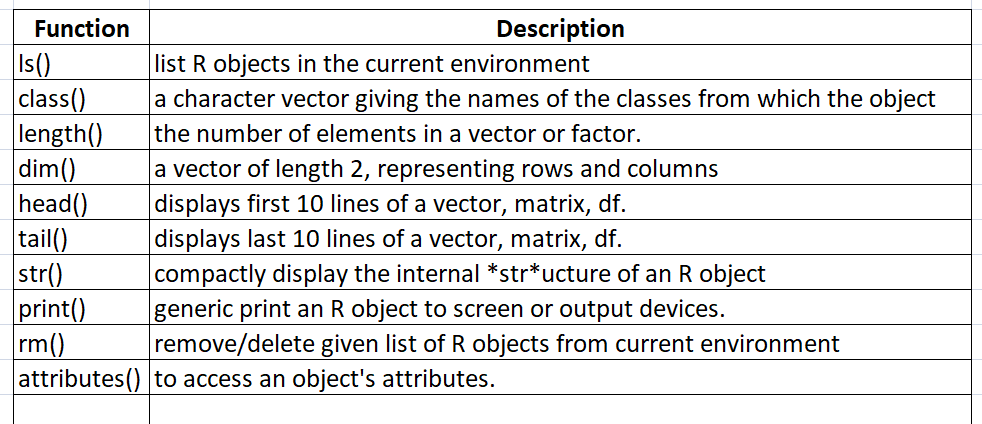

```{r setup, include=FALSE}
knitr::opts_chunk$set(echo=FALSE)
library(knitr)
```
About me
================================
## Currently  
- PhD student LQFPP/CBB 

## Research interests  
- Bioinformatics  
- Plant genomics  

## Skills and experience  
- Unix and grid computing
- Reproducible research using various languages such as Shell, Perl, R, Python.
- Web development

## Connect  
- Email: kcm.eid@gmail.com  
- Twitter @kc_moharana  
- http://lattes.cnpq.br/2585560606421215

# I assume 
- You have basic understanding of MS Excel
  - Excel Sheets, tables
  - Generating basic plots
  - Using simple formula

- You have installed following software on your laptop
  - R software
  - R studio
  - Excel 
  
- Example Data sets 
  
We will not cover 
===================================
- Advanced statistical tests
  - hypothesis testing
  - Multivariate tests
  - Machine learning
  - Clustering, Classification
- Bioinformatics analysis

Learning objectives: Day 1
========================================================
- Introduction to R
  - Basic setup
  - Get help
- Data types and Objects 
  - Vectors
  - Factors
  - Matrix
  - List
  - Data frame
  - missing values
- Class Coercion  
- Reading and writing Data files
- Sub setting 
  

R 
=================
R is a free software environment for statistical computing and graphics. It compiles and runs on a wide variety of UNIX platforms, Windows and MacOS.  

### History
- S language (Bell Labs) 
- **1991:** Ross Ihka and Robert Gentleman started developing R language. 
- **1993:** First public announcement of R
- **1995:** GNU free license to R
- **1996:** R public mailing group was created. 
- **1997:** The R Core group was created.
- **2000:** R version 1.0 was released
- Current version 3.6.1: https://cran.r-project.org

R 
==============================
### Pros

- Reproducible data intensive research 
- A programming language
- Large community
- Huge number of free to use libraries.
- Easy learning curve. 

### Cons
- Hard to master  
- Large data takes large memory.
- https://www.r-bloggers.com/why-r-is-hard-to-learn/

Basic Setup
=====================================
- Download and install R 
  - https://cran.r-project.org/
  - https://mran.microsoft.com/  
- Latest version : R 3.6.1
- Integrated Development Environment (IDE)  
  - R-studio 
- Online editors  
  - https://rdrr.io/snippets/

Core R terminal
=====================================
```{r fig.asp=0.62, out.width = "90%",}

```

R Studio: interactive developmental environment
=====================================
```{r fig.asp=0.62, out.width = "60%", fig.align="right"}

```

1. Syntax-highlighting code editor
2. R terminal   
3. WorkSpace: Variables and function   
4. View plots/help  

Hello world
=============================
- On R terminal type the follwoing 

## Hello world !   

```{r echo=T}
# This is a comment line and will not execute 
print("hello")

```

Using Panel-1 to execute code 
==========================
- type the follwoing on the panel-1 of R-studio
- select all lines and press `Ctrl+Enter`

## Print R version 

```{r echo=T}
r_version <- getRversion()
print("your R version is: ")
print(r_version)
```

## Save the script 
- Use `File -> save as` to save the script as `print_r_version.R`

R terminal as calculator
===============================================
- R interface can be used as a simple calculator. 
```{r out.width = "10%", fig.align="right"}
include_graphics('Figures/calc.png')
```

```{r, echo=T, eval=FALSE}
# Type on R terminal 
1+5
100 * (10+40+33)/200
a  = 10
b  = 34
a + b
```

Assignment operator (<-), left to right
===================================
- To store values in a variable (on RAM)
- equals to(=) or `<-`
  - both can be used for assignment
  - `<-` is more accepted for variable assignment
  - `=` used for defining function parameters.

```{r echo=T}
## Type on your R terminal 
foo <- 10.3
bar <- 89
baz <- foo * bar
```


R built-in functions
=========================================
```{r out.width = "20%", fig.align="center", fig.cap="Excel sum() function"}

```
- **functions** are a type of procedure or routine
  - often accept input and parameters
  - performs some operation and may return a value
- use a pair of parenthesis '()'

R built-in functions
=========================================

```{r echo=T, eval=F}
# Diplays demo plots
demo()

# Get help
help()
# help on any topic, e.g plot
help('plot')
# list all files in current working direcotry 
dir()

# Exit R terminal
q()
```

Working directory
================================
- Where to find and save necessary files on your computer. 
- Should be defined before beginning any analysis.
- Use menus, 
  - `Session -> Set working directory.`
- Using command line `getwd()` and `setwd()`

```{r,echo=T, eval=FALSE}
# Get the current working directory
getwd()
# Set the current working directory to PATH
setwd("path/to/address")

# Change \ to  \\ or / for Windows 
setwd('C:/Users/Kanhu/Desktop/R_course')
## OR 
setwd('C:\\Users\\Kanhu\\Desktop\\R_course')

```

Basic syntax rules
===================================
- Each line may have an optional semicolon (;) 
  - useful in writing compact functions 
- Multi-line instructions should be separated by plus (+)
  - `ggplot2` uses +
- **Comments:** A comment is a way of annotating code.
  - Hash (# )symbol is used at the beginning of the line. 
  - These lines will not be executed by R
  - Instruction or documentation purpose

- **Functions:** Executes predefined instructions
  - accepts parameters.
  - Example:   
  `x <- 'I love UENF'`
  `print(x, ...)`  
  
  
Tabular data
============================
```{r out.width = "80%", fig.align="center", fig.cap="Tables with rows and columns"}

```
- A table has rows and columns

Cell address
====================================
```{r out.width = "50%", fig.align="center", fig.cap="Cell address: M7 (Column:M, Row:7) "}

```
- Each bit of data is stored in a CELL
- Collection of CELLs make a SERIES
  - Two cells can be used for mathematical operation and the result can be saved in another cell. 
  - Row number and column number can be used to point to one cell
  
Data table
========================================

- Many SERIES combine together to form a table
  - A series can be a column or row
  - Useually one column has a distinct datatype

Data types  
==========================
```{r out.width = "90%", fig.align="center", fig.cap="Each column has distinct datatype"}

```

Data types in R
===============================================
1. **Logical :**  `TRUE, FALSE`
2. **Character:**  `'a','name','TRUE', "1234", "--NA", "+2"`
3. **Integer:**  `10,  20,100, 78`
4. **Double:**  `0.0001, 12.898, 10e-10`
5. **Complex:** `3 + 2i`
6. **Raw:** 

Variables and R objects
=========================================
- In programming, a variable is a value that can change, depending on conditions or on information passed to the program. 
- Rules to follow: 
  - Identifiers can be a combination of letters, digits, period (.) and underscore (_).
  - It must start with a letter or a period. If it starts with a period, it cannot be followed by a digit.
  - They are case sensitive. e.g `Data_table` NOT equals to `data_table`

Variable names 
====================
### Acceptable variable names
`total, Sum, .fine.with.dot, this_is_acceptable, Number5`  

### Wrong variable names
- `tot@l, 5um, _fine, TRUE, .0ne`

- Reserved words in R cannot be used as identifiers.
  - Reserved words : 
      - `for, if, next` 
  - Pre-defined Constants :
      - `pi, LETTERS, letters, month.name`

Objects in real world
=================================
```{r out.width="50%"}

```

## Class, attributes and  objects
- **Class :** Car has several **attributes**
  - Number of wheels
  - Fuel
  - Color
- Instances of each class is an **object**
  - So each class inherits the attributes of the class

Objects in R
=================================

## Primary objects
- **Vector:** collection of values
- **Matrix:** 2D-collection of multiple vectors
- **Array :**  >2D-collection of multiple vectors

## Derived objects
- List
- Data frame

## Special Vector
- Factor

Objects in R
=================================
```{r out.width="90%"}

```

Vectors
===========================
- Basic type of 'R object'
- Only one type of data
- Similar to one column in Excel Table. 
- If there is one character data, will convert all to character
- If there is one decimal data, convert all to decimal


Vectors
===========================
- type on R terminal 
```{r, eval=FALSE, echo=T}
x <- vector(mode='double',length=5)

# Three 'shortcuts' to create  numerical vector
a <- c(1,2,5,6,7)
b <-  1:5
c <- seq(12,20, by= 2)

dec <- seq(0, 0.5, by=0.025)

products <- c('milk', 'mango', 'good')

```

Factors
=======================================
- Categorical data
  - Ordered (High, medium, Low)
  - Unordered (Male, Female)
- Can be also integers
- Useful in data modelling problems

- Factors are vectors(), with additional information or attribute called levels, representing that order

```{r, eval=FALSE, echo=T}
## Create a vector 
x <-  factor(
  c('yes', 'no', 'no', 'yes', 'no'),
  levels = c('yes', 'no')
)
```

Factors
=======================================
- Some functions are useful to create factors  

## gl()
- Generate factors by specifying the pattern of their levels.
```{r echo=T}
# 2 conditions and 8 replication each
 gl(2, 8, labels = c("Control", "Treat"))
```
## rep()
- Replicate Elements of Vectors
```{r echo=T}
 rep(x=1:2, each=2, times=3, length.out=6)
```

Matrix
===================================


Matrix
===========================================
- Are vectors with dimension attribute (# of rows, # of columns)
- Only one type of data

```{r echo=T}
# Empty matrix
m <- matrix()

m1 <- matrix(c(1,2,3,4), byrow=T, nrow=2)
m1
m2 <- matrix(c(1,2,3,4), byrow=F, nrow=2)
m2 
dim(m1) 

```

Matrix for a vector
===========================================
- We can devide a vector to matrix of specified columns and rows. 
- R can interpret the number of rows and columns from your arguments
  -  byrow=F,  byrow=T


Create matrix from vectors using functions 
=============================
### cbind() , rbind()
- `cbind()` : bind columns
- `rbind()` : bind rows

```{r out.width="50%"}

```

Create matrix from vectors using functions 
=============================

```{r echo=T}
a <- 1:5
b <- 11:15
c <- 21:25

cbind(a,b,c)
rbind(a,b,c)
```

Mix multiple datatypes in a matrix
================================
```{r echo=T}
#Character matrix
mat <- matrix(c('a','b','c','k'), byrow=T, nrow=2)
mat

## Mix an integer type value
mat2 <- matrix(c('a',1,'c','k'), byrow=T, nrow=2)
mat2
```

Data frames 
=================================
- Data frames  are collection of *named* vectors.
```{r echo=T}
df  <- data.frame(
     Name = c('Robert', 'Priyanka', 'John'),
     Height = c(167.1, 156.9, 162.5)
)
df
```

Data frames 
=================================


Read tabular files to create DF
============================


List
=============================
- Collection of R objects
  - Objects can be of different class
  
```{r echo=T}
new_list  <-list(
     name = c('Robert', 'Priyanka', 'John'),
     Height = c(167.1, 156.9, 162.5),
     num_elements=2
)
new_list

```

Missing Values
=================================
- Undefined values
- Denoted by NA or NaN
  - **NaN:**  for mathematical operations (e.g:  0/0)
  - **NA:** everything else
    - character NA
    - Integer NA
- **NaN** can be equal to **NA**, but reverse is not true
- *is.na()* used to check **NA** values in a vector
- *is.nan()* used to check **NaN** values


```{r echo=T}
x <- c(5,6,NA,9)
is.na(x)

x <- c(5,6,NaN,9, NA)
is.na(x)

is.nan(x)

```

Class Coercion
=======================================
## 1. Implicit coercion
  - sometimes different classes of R objects get mixed together
  - vectors and matrices cannot have values of different datatypes
  - coercion occurs so that every element in the vector is of the same class.
  - lower ranking type will be coerced into the higher ranking type
    - logical < integer < numeric < character
```{r echo=T}
y <- c(1.7, "a")   ## character
y
p <- c(TRUE, "Hello")
p
q <- c(TRUE, 12)
q
```

Class Coercion
=======================================
## 2. Explicit Coercion
- Objects can be explicitly coerced from one class to another using the 'as.*' functions.
```{r  echo=T}
x <- 0:6
class(x)
as.numeric(x)
as.logical(x)
```

Class Coercion
=================================
## Data frame to matrix
- often many operations require the input as matrix
```{r  echo=T}
df <- data.frame(foo=1:5,bar=11:15)
df
class(df)
as.matrix(df)
```

Class Coercion
=================================
## List to data frame
```{r eval=F, echo=T}
l <- list(gene=c('APO','ANN5','SPT'), 
          sample1=c(1.4,0.5,2.5),
          sample2=c(2.4,0.3,0.5)
          )
class(l)
as.data.frame(l)
```

generic functions and operations
======================================



Name attribute
=============================
- Naming column and rows makes it easier to data manipulation and human readable. 
- All R objects can have names attribute  
## Named vectors 
- each element in a vector can be named.

```{r  echo=T}
a <- c('a'=5, 'b'=10, 'c'= 2)
a
names(a)
```

Name attribute: Matrix
=============================
## Matrices
- Row and column  of a matrix can be  named 
- dimnames() : for matrices  
  - colnames() : column names  
  - rownames() : row names  
```{r  echo=T}
m = matrix(c(1,2,3,4), byrow=F, nrow=2)
dimnames(m) =list( c('p','q'),c('r','s') )
m
colnames(m)
rownames(m)
```

Name attribute : data frames
=============================
## data frames
- row.names(): get/set row names  
  - row.names() : always unique for each row  
- names(): get/set column names  
  - - names() : always unique for each column  

```{r  echo=T}
df = data.frame(
  k=c('q','a','r'),
  l=c(1,2,3)  
  )
df

row.names(df) 
```

Name attribute : data frames
=============================
## data frames
```{r  echo=T}
names(df) 

# Assign new row names
row.names(df) <- c('a','b','c')
# assign new column names
names(df) <- c('foo','baz')

df
```


Create file by input from keyboard
======================================
## Enter data using editor
```{r, eval=FALSE, echo=T}
mydata <- data.frame(
  age=numeric(0), 
  gender=character(0), 
  weight=numeric(0)
 )

mydata <- edit(mydata)
```
Contd...  

Create file by input from keyboard
======================================
## Enter data using editor


Read/Write data from text file
=================================
## Read
- Two important functions to read tabular data
  - `read.table()`, `read.csv()`
- Read R script  (*.R)
  - `source()`
- Read saved R data objects (*.RData)
  - `load()`

Read/Write data from text file
=================================
## Write
- Two important functions to write tabular data
  - `write.table()`,` write.csv()`
- Save the  R command to a text file (*.R)
  - `savehistory()`
- Read current R data objects to a binary file (*.RData)
  - `save()`

Iris Flower data set
================================
## Tabular data
```{r echo=F}

knitr::kable(head(iris), caption="First 6 lines")

```

read.table()
=========================

- Reads a file in table format and creates a data frame from it.

```{r eval=F, echo=T}
df <- read.table(file="iris_dataset.csv", 
  header = FALSE,  ## TRUE, if 1st row repsresnts the header
  
  sep = "", ## Column separator
  
  skip = 0, ## Skip top 'n' number of lines
  
  check.names = TRUE, ## Check column names for characters like space, comma, @
  fill = !blank.lines.skip,
  strip.white = FALSE, 
  blank.lines.skip = TRUE
)

```

read.csv()
===================================

- tweaked version of read.table()
  - some parameters are predefined 
  - recommended 
```{r eval=F, echo=T}
df <- read.csv(file="iris_dataset.csv",  
  header = TRUE, 
  sep = ",", 
  quote = "\"",
  dec = ".", 
  fill = TRUE, 
  comment.char = "",
 ...
)
```


write.table() / write.csv()
==============================

```{r eval=F, echo=T}
write.csv(data_frame, file="output_dataframe.csv",  
  header = TRUE, 
  quote = FALSE,
  row.names = TRUE,
  col.names = TRUE
)
```

write R code and read pre-defined codes
====================================
### savehistory()
- Write the R command history to a text file
- Use extension .R


### source()
- read and execute codes written in a plain text file
- usually .R extension

`save` and `load` R objects
============================
- writes an external representation of R objects to the specified file.
- The objects can be read back from the file at a 	later date by using the function 'load' or 'attach'
- Use .RData extension

```{r eval=F, echo=T}
## Save the current environment (all objects) to one file 
save(data, vector_a, file= "analysis_results.RData")


## Reload all objects) from .RData file
load("analysis_results.RData")

```

Real life example of importing tabular data
============================================


Source: https://pokemondb.net/

Real life example of importing tabular data
===============================================

Source: https://www.kaggle.com/rounakbanik/pokemon/data

Real life example of importing tabular data
===============================================

## Prepare your dataset
- if your data is in excel export it as csv file.
  - or tab separated file (*.tsv)
```{r echo=T}
# Read the *.csv file 
pokemon_data <- read.csv(
  file='Data/pokemon_data.csv',
  sep=',',
  header=TRUE
)

# Get an over view of the data 
dim(pokemon_data)
```

Get overview of data frame
====================================
```{r echo=T}
# See top 10 lines 
head(pokemon_data)
```

Get overview of data frame
====================================
```{r echo=T}
# See datatypes 
str(pokemon_data)
```

Packages available in R
================================
- a packages is a free libraries of code written by R's active user community.
- They add many useful R functions to your R environment


Install external packages
==================================
- To install an R package, open an R session and type at the command line  
 `install.packages("<the package's name>")`
-  install an package to read Excel files
  - search on internet or r-cran.org


```{r eval=F, echo=T}
## Install many packages as a vector
install.packages(
  c('readxl','gplots')
  )
```

- usually installs in "My Documents"


# Thank you.
```{r out.width='100px', echo=F}
knitr::include_graphics('Figures/nebbio_logo.png')
```
