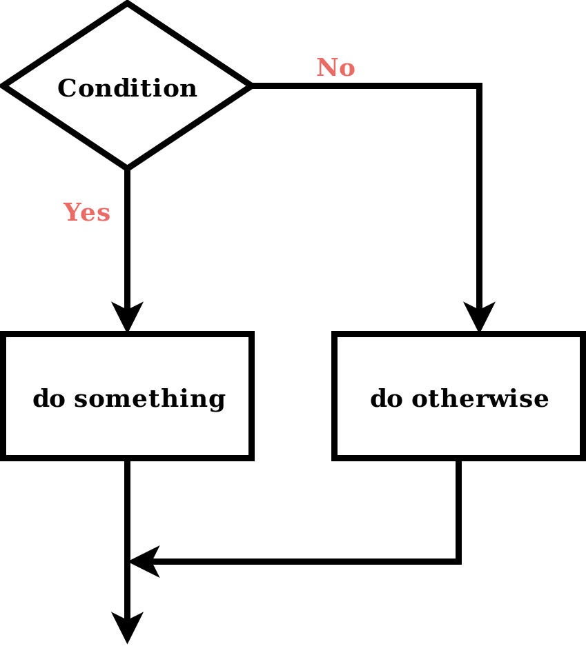
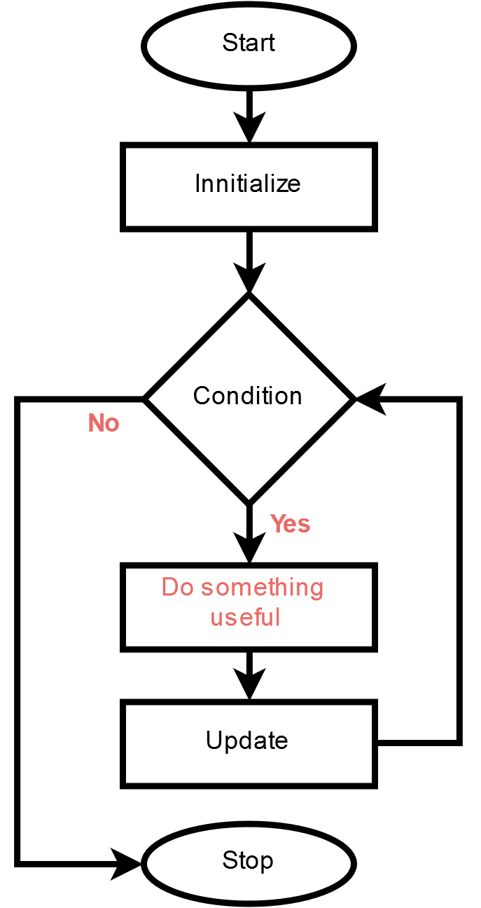
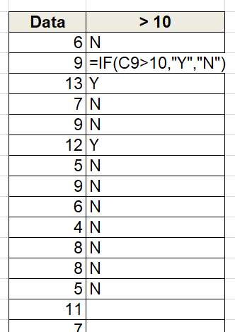
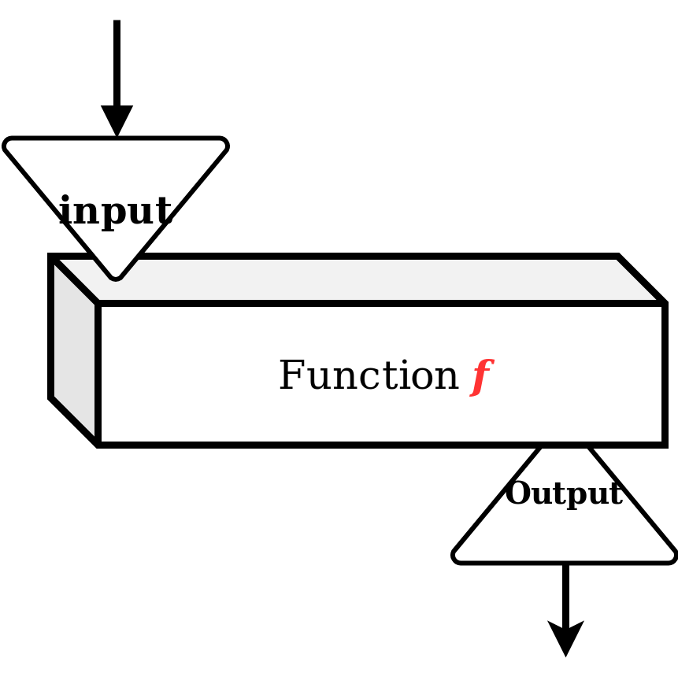
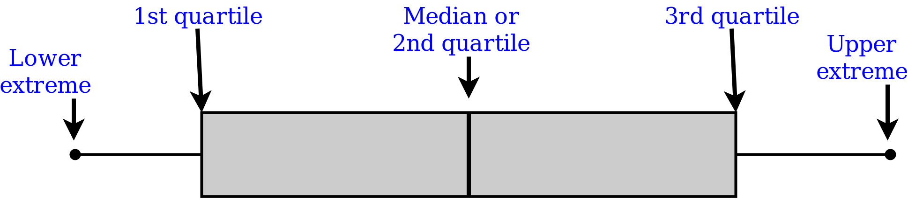
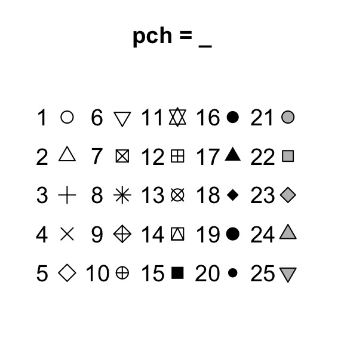

```{r setup, include=FALSE}
knitr::opts_chunk$set(echo=FALSE)
library(knitr)
#library(kableExtra)
```


Learning objectives
=================================
- Subsetting R objects  
- Operators used in subsetting  
- Functions  
  - Built-in and Utility functions   
  - Statistical functions  
  -The 'apply' family functions  
  - apply()  
  - sapply()  
  - lapply()  
- Descriptive statistics using R
- Statistical Plotting using base R

Operators used in Subsetting
=================================

- Single square bracket ( [ ) : 
  - Useful to select one or more elements
  - returns object of same class. 
- Double square bracket ( [[ ) :
  - Extract elements of a list or a data-frame
  - Returns object of different class 
- Dollar operator ($) :
  - Extract elements of a list or a data-frame by Name attribute
  - Similar to [[ 
  
Single square bracket ( [ ) 
==============================

```{r echo=T}
a <- c('a','e','i','o','u')
a[1]
a[5]
a[6]
a[1:4]  # 1:4 returns all numbers from 1 to 4
```
Contd...  

Single square bracket ( [ ) 
==============================
## Logical vector  
- we may also use a logical vector to subset 
  - only `TRUE` indices are returned 
```{r echo=T}
# we may also use a logical vector to subset 
a[c(TRUE, FALSE, TRUE)]

# Create a logical vector and pass 
a[a > 'a']
```


Double square bracket ( [[): list 
====================================

```{r echo=T}
l <- list( 1:5, 0.5 )
l[[1]]
l[[2]]
```
```{r, eval=F,echo=T}
l[[3]]
```
```{r, echo=T}
#l[[3]]

```

Dollar operator ($) 
==============================

## Dollar ($) operator 
```{r echo=T}
k <- list( foo=1:5, bar=0.5 )
k
k$foo
k$bar
k$baz
```

Dollar operator ($) vs Double square bracket 
========================================
### Why use "[[" over $?
- "[[" are useful with variables
```{r echo=T, eval=T}
score <- list(
  country=c('Brazil','Germany'),
  goals=c(8,3)
  )
x <- 'country'
score[[x]] ## prints  'Brazil','Germany'
score$x    ## NULL

```


Subset matrices
================================
- `MATRIX [ <row> , <column>  ]` : one particular elemnt  
- `MATRIX [ <row_range> , <column0_range>  ]` : elements from the range  
- `MATRIX [ , <column>  ]`: all rows and specified columns  
- `MATRIX [ <row> ,  ]` : all columns of  specified rows  

```{r echo=T, eval=F}
mat <- matrix(1:15, byrow=T, ncol=3)
mat

mat[1,1] # row, column
mat[3,1]

mat[1, ]  # single row
mat[ ,3]	# single column

mat[ ,3, drop=F]
```

Subset matrices
==================================
```{r echo=T}
mat <- matrix(sample(1:100, size=8), byrow=T, ncol=2)
colnames(mat) <- c('sample_1','sample_2')
rownames(mat) <- c('Gene1','Gene2','Gene3','Gene4')
mat
```
- `MATRIX [ <row name vector> , <column name vector>  ]` : select rows and columns 
- `MATRIX [ <row name vector> ,   ]` : select all columns of specified rows
- `MATRIX [ , <column name vector>  ]` : select all rows of specified columns
Subset matrices
==================================
### Filter rows
```{r echo=T}
mat['Gene3',c('sample_1','sample_2')]
mat['Gene3',]
```

### Filter columns
```{r echo=T}
mat[c('Gene1','Gene2','Gene3'), 'sample_1']
mat[, 'sample_1']
```

Subset dataframes
===============================
- similar as matrix subset
- can use `$` to select a column
```{r echo=T}
df <- data.frame(
   foo=seq(1,10,by=2),
   bar=seq(0.1, 0.5, by=0.1),
   baz=letters[10:14]
)
df
```
Subset dataframes
===============================
## Subset using row index
```{r echo=T}
df[1, ]
df[1:2, ]
```

## Subset using column index
```{r}
df[, 3 ]
df[, 1:2]
```

Subset dataframes
==================================
## Subset columns using 'names' attributes
```{r echo=T}
# using [ like a vector()
df[, 'foo']
# using [[ like a list()
df[['foo']]
# using dollar like a list()
df$foo

df[, c('foo','bar')]
```

Subset dataframes
==================================
## Subset rows using 'row.names' attributes
```{r echo=T}
row.names(df)
## Assign a unique column as row.names()
row.names(df) <- df$baz
df

df['k',]
df[c('k','n'),]
```

Removing missing values
=============================
- Empty/missing values: NAs
  - create a logical vector or matrix
  
```{r echo=T}
# in vectors 
dat <- c(1,14,NA,8, NA)
bad <- is.na(dat)
bad
dat[bad]
# bang (!) is used for negation 
dat[!bad]
```


Removing missing values
================================
## 1. `complete.cases()`
- Return a logical vector indicating which cases are complete, i.e., have no missing values
```{r echo=T}
mat <- matrix(seq(1,12), ncol=3)
mat[1,3] <- NA
mat[2,2] <- NA
```
```{r echo=T}
mat
good <- complete.cases(mat)
good
mat[good,]
```
Removing missing values
================================
## 2. `na.omit()`
  - returns the object with incomplete cases removed.
```{r echo=T}
na.omit(mat)
```

Example: Filter countries with data for each year
=========================
```{r echo=T}
## Import data as a data frame
dat <- read.csv(
  file='Data/Infant_mortality_rate_UN.csv', 
  skip = 1, 
  check.names = F
  )
## Rows and columns, also try dim(dat)
nrow(dat)
ncol(dat)
```
Contd...   

Example: 
=========================
```{r echo=T}
## remove NA rows
dim(na.omit(dat))
## Use LOGICAL vector returned by  complete.cases(dat) to subset
dim(
  dat[ complete.cases(dat) , ]
)
```

## `na.omit()` vs `complete.cases()`
- `na.omit` and `complete.cases` functionally look similar  
  - `na.omit()` : returns the object with filtered values  
  - `complete.cases()`: returns a logical sequence.  
  - More: <sub>https://stackoverflow.com/questions/29472540/when-to-use-na-omit-versus-complete-cases</sub>  


Vectorized Operations
============================
- perform computational operation on the vectors in a parallel fashion  
- do not require looping
```{r echo=T}
## Add 1 to each value in the vector
foo <- c(11,18,100,8)
foo + 1

## Mathematical operation each element by element
a <- c(1,2,5,10)
b <- c(15,3,3,1)
a * b
```

Vectorized Operations
============================
- The examples shown can only be executed if the vector or matrices are of equal dimentions.

```{r echo=T}
m <- matrix(c(10,22,12,18), ncol=2)
n <- matrix(c(22,5,0,2), ncol=2)
m * n
```


- This is not matrix multiplication.  
  - Mathematical matrix multiplication can be performed using ` %*% `  
  - See : https://www.mathsisfun.com/algebra/matrix-multiplying.html

Control structures 
================================
- In a program, a control structure determines the order in which statements are executed. 
- control execution of the programs  
  - if, else  
  - `for` loop  
  - `while` loop  
  - `break`  
  - `next`  
  
```{r out.width="20%",  fig.align="right"}

#
```

  
Logical operations
=============================
- We can control execution of some instructions using logic operations by manipulating Boolean values (`TRUE/FALSE, 1/0` ).
```{r echo=T}
name <- 'Kanhu'

## `==` is used to compare two varaibles and get a Boolean value
name == 'kanhu'
name == 'Kanhu'
name != 'kanhu'

# Numeric value
5 > 10

# Alphabets
'a' < 'e'
```

Logical operations
=============================
```{r echo=T}

## vectorized operation
a <- c(10,5,18,100,NA)
a > 5

## Boolean values can be used for subsetting 
a[a>5]
```

Logical operators
========================

|Operators | Description|
|--------|--------------|
|<       | Less than    |
|>       | Greater than |
|<=      | Less than equal to|
|>=      | Greater than equal to |
|==      | Equal to     |
|!=      | Not equal to     |


### Multiple logic
|Operator | Description|
|--------|--------------|
| ! | NOT |
|&       | AND    |
|&#124;       | OR | 

Logical operators
========================
### Truth Tables
- if `p` and `q` are two logical comparisons 

#### AND  
|p | q| p   AND q|
|--------|--------------|---|
|TRUE  | TRUE    | TRUE |
|FALSE  | TRUE    | FALSE |
|TRUE  | FALSE    | FALSE |
|FALSE  | FALSE    | FALSE |

Contd...

Logical operators
========================

#### OR  
|p | q| p   OR q|
|--------|--------------|---|
|TRUE  | TRUE    | TRUE |
|FALSE  | TRUE    | TRUE |
|TRUE  | FALSE    | TRUE |
|FALSE  | FALSE    | FALSE |


ifelse()
=====================
```{r out.width="15%",  fig.align="center", fig.cap="IF() formula in Excel."}

#
```

- Like excel R, `ifelse()` function can perform condition check.

```{r echo=T}
# if any value >10, assign 'Y'
x <- c(5,10,20,22,6,8,19,40,45,2,5) 

ifelse(x>10,"Y","N")
```

Example: Blast tabular output
=============================
- You have a BLAST output. Import the Hit table in to R and filter those hits with evalue < 10^-5

```{r echo=T}
# import BLAST tabular output
BLASTn <- read.csv(
  file='Data/BLAST_hitTable.csv', 
  header=FALSE
  )

```

## BLASTn
```{r echo=F, fig.align="center"}
knitr::kable(head(BLASTn,3))

# Num of rows and columns in dataframe 
dim(BLASTn)
```


Default Blast tabular output (format 6)
=========================================

|Header | Description|
|-------|------------|
|q.seqid|a factor, query (e.g., gene) sequence id|
|sseqid	|a factor, subject (e.g., reference genome) sequence id|
|pident|numeric vector, percentage of identical matches|
|length|integer vector, alignment length|
|mismatch|integer vector, number of mismatches|
|gapopen|integer vector, number of gap openings|
|q.start|integer vector, start of alignment in query|
|q.end	|integer vector, end of alignment in query|
|s.start|integer vector, start of alignment in subject|
|s.end	|integer vector, end of alignment in subject|
|evalue	|numeric vector, expect value|
|bitscore	|numeric vector, bit score|

Example: Blast tabular output
=============================
```{r echo=T}
# set the column headings using 'names()'
names(BLASTn) <- c('qid','sid','pident','length', 
                   'mismatch','gapopen', 'q.st','q.en',
                   's.st','s.en', 'evalue','bitscore')
```

Example: Blast tabular output
==============================
```{r echo=T}
## Filter rows where evalue is less than 1e-5
BLASTn_2 <- BLASTn[BLASTn$evalue < 1e-5, ]

## Evalue Filtered data 
dim(BLASTn_2)

## Filter rows where evalue is less than 1e-5 AND identity percentage >90
BLASTn_3 <- BLASTn[BLASTn$evalue < 1e-5 & BLASTn$pident >90, ]

## Evalue - %identy Filtered data 
dim(BLASTn_3)
```


if..else
==========================
- Similar to `ifelse()`, but more powerful
- can perform more than one instructions

```{r echo=T}
if(name == 'Kanhu'){
  print('Hello Kanhu')
  print('Multiple statements ')
}else{
  print('Hello stranger')
}
```

for() loop function
======================

- "Looping", "cycling", "iterating" or just replicating set of instructions

```{r out.width="20%",  fig.align="center", fig.cap="For loop "}

```

for() loop function
======================
## Syntax 
`for (x in VECTOR)`  
`{`  
`  instruction1 to execute using x`  
`  instruction2 to execute`  
`  instruction-N to execute`  
`}`  
- x will be each value from VECTOR.   

for() loop function
======================
```{r echo=T}
for(i in 1:4){
  print(i)
}
```

Using for loop to append data to an existing R object
===================================
```{r echo=T}
credits <- c(0.8,0.5,0.4,0.33,0.9)
# Create a empty numeric vector()
percentage_credit = vector(mode='numeric')
## Sum total of credits
total_credit <- sum(credits)

for(i in 1:length(credits) ){
  ## i will iterate over 1.. length of 'credits' vector
  i_th_perc <- 100 * credits[i]/total_credit
  ## update each index of percentage_credit
  percentage_credit[i] <- i_th_perc
}
percentage_credit
```


Functions
=========================
- A function is a block of organized, reusable code that is used to perform a single, related action. Functions provide better modularity for your application and a high degree of code reusing.  
- they accept inputs to process and return output.  
```{r out.width="20%",  fig.align="right",}

```

`https://www.tutorialspoint.com/computer_programming/`
`computer_programming_functions.htm`

Built-in functions
==========================================
- Like Excel, in R there exists several built-in functions. 

```{r echo=F}
knitr::kable (as.data.frame(matrix(c('c()','paste()','read.csv()','rep()','mean()','write.csv()','seq()','min()','read.table()','print()','max()','sd()'), ncol=3) ) )
```

Useful Built-in functions
===============================
## 1. `seq()`
```{r echo=T}
# seq(x,y): create a sequence of numbers from x to y
seq(1,5)  # see details using ?seq()
seq(1,10, by=2)
seq(5,-5)
```

Useful Built-in functions
===============================
## 2. `rep()`
```{r echo=T}
# rep(x, n): replicates the values in x, n times.
rep('foo', 5)  # see details using ?seq()
rep(c('foo','bar'), each =2 )
rep(c('foo','bar'), each =2, len=10 )
```

Useful functions
========================
## 3. `paste()`
```{r echo=T}
# paste(m,n): concatenate m and n 
genes<- c('DMPK', 'ATN1', 'EGFR','FMR1', 'HTT')
paste('At_',genes)
paste('At',genes, sep='_')

# Convert into one string
paste('At',genes, sep='_', collapse=",")
```

Useful Built-in functions
===============================
## 4. `strsplit()`
```{r echo=T}
a <- 'My name is kanhu'
strsplit(a, split=' ')

a <- c(
  'My name is kanhu', 
  'R is wonderful'
  )
strsplit(a, split=' ')
```

Useful functions
========================

## 5. `summary()`
```{r echo=T}
x <- c(1,10,100,0.6,55)

#min(x)
#max(x)
#sum(x)

#mean(x)
#sd(x)
summary(x)
```

Useful Built-in functions
===============================
## summary of numerical tables
```{r echo=T}
head(iris, n=3)
mean(iris$Sepal.Width)
# Over all summary 
summary(iris$Sepal.Width)
```

The `apply` family functions
======================
- `for()` is powerful, but needs a lot of typing.
- just hidden loops

## A dataframe 
```{r echo=T}
df <- data.frame(
  A=sample(1:20,5),
  B=sample(11:200,5),
  C=sample(101:300,5) 
  )
```

```{r echo=F}
knitr::kable(df)
```

Calculate sum per row: the `for()` loop way
==========================================
```{r echo=T}

# create empty column 'Sum' 
df$Sum = NA

for(i in 1:nrow(df) ){
  # sum values from 1-3 column and assign to sum
  df[i,'Sum'] <- sum(df[i,1:3])
}
df
```

Useful functions
========================
## 6. `apply()` function

- `apply()` is used to execute a function (can be anonymous one) over the margins of an array.

```{r eval=F, echo=T}
apply(X, MARGIN, FUN, ...)
```
- X: Matrix
- MARGIN:
 - 1: Row wise
  - 2: Column wise
  
- FUN: function (can be anonymous)
- ...: parameters to FUN
- returns a vector

Calculate sum per row: `apply()` way
=============================
```{r echo=T}
# Create a copy of df
df2 <- df[1:3]

## Use 1 as second argument to iterate over rows
df2$Sum <- apply(df2, 1, sum )
df2

```

Calculate sum per COLUMN: `apply()` way
=============================

```{r echo=T}

## Use 2 as second argument to iterate over columns
apply(df2, 2, sum )
```

More examples of `apply()`
======================
##  Calculate average 
```{r echo=T}
# Create a copy of df (excluding 'Sum' column)
df2 <- df[1:3]
## Use 1 as second argument to iterate over rows
df2$Mean <- apply(df2, 1, mean )
df2
```
Contd...

More examples of `apply()`
======================
##  Calculate standard deviation
```{r echo=T}
df2 <- df[1:3]
## Use 1 as second argument to iterate over rows
df2$SD <- apply(df2, 1, sd )
df2
```
Contd...

More examples of `apply()`
======================
## Calculate 25th and 75th quantiles
```{r echo=T}
# Create a copy of df
df2 <- df[1:3]
## Use ?quantile to see details about quantile()
## - prob=c(0.25,0.75) is a parameter for quantile()
apply(df2, 1, quantile, prob=c(0.25,0.75) )

```

Useful functions
========================
## 7. `lapply()`: loop over lists

- `lapply()` loops over a list and evaluates a function.
- always returns a list

```{r echo=T,eval=T}
x <- list(
  a = 1:20,
  b = seq(0,1, length=10),
  c = seq(1,100, length=14)
)
x
```

`lapply()`: loop over lists
===============================
```{r echo=T}
## calculate mean of each objects in the list x
lapply(x, mean)

## calculate mean of each objects in the list x
lapply(x, summary)
```

Useful functions
========================
## 8. sapply(): loop over vectors

- `sapply()` is similar to *lapply()*, but it returns a vector
```{r echo=T}
x <- c(15,105,150,199)
## calculate mean of each objects in the list x
sapply(x, mean)


labs <- c('LBR','CCTH', 'LQFPP')
## add /UENF to each lab
sapply(labs, paste, 'UENF', sep='/')
```

Useful functions
========================
## 9. `sample()`
- Select N random samples from a given vector  
  - https://web.ma.utexas.edu/users/parker/sampling/repl.htm  
  - https://en.wikipedia.org/wiki/Nonprobability_sampling   
```{r eval=F, echo=T}
sample(
  x   =  input vector of one elements ,
  size=  the number of items to choose,
  replace = FALSE sampling be with replacement? , 
  prob = vector of probability weights for input elements
  )
```
```{r echo=T}
x <- c(1,15,18,3,-9,11)
sample(x, size=3)

sample(x, size=3, replace=T)
```
Contd ... 

Useful functions
========================
## 9. `sample()`
```{r echo=T}
x <- c(1,15,18,3,-9,11)
# assign probability  to each element of x
p <- c(0.1,0.9,0.1,0.3,0.5,0.1)

sample(x, size=3, prob=p)

sample(x, size=3, prob=p, replace=T)

sample(x, size=4, prob=p, replace=T)
```


Useful functions
==================
## 10. `rnorm()`  
- generates  random numbers following normal distribution with user defines `mean` and `standard deviation` 

```{r eval=F, echo=T}
rnorm(
  n = number of observations,
  mean = desired mean value (default 0),
  sd = desired standard deviation value (default 1),
  )
```
Contd...  

Useful functions
==================
## 10. `rnorm()`


### Example  

```{r echo=T}
random_number <- rnorm(n=20, 
                       mean=3, 
                       sd=8)

# length
length(random_number)

# Mean
mean(random_number)

# SD
sd(random_number)

```


Descriptive Statistics and Data Visualization
=======================================
- data visualization is an important part of statistics.
- enables to spot trends and relationships
- make sense of huge amounts of data so that you can take decision

- Central tendency
  - Mean, median
- Data Spread
  - Standard deviation
  - variance
  - inter quartile range
  - median absolute deviation

Frequency data
==================================
- Categorical data are often summarized as frequency tables

```{r echo=T}
toss <- c('H','T','T','H','T','H','T','T','H','T','H','T','H','T','T','H','H')
table(toss)
```

Frequency data from data frames
==================================
## Pokemon data
```{r echo=T}
# Read the *.csv file // verify your working directory 
pokemon_data <- read.csv(
  file='Data/pokemon_data.csv',
  sep=',',
  header=TRUE
)

# Number of Creatures per generatin
table(pokemon_data$generation)
```

Visualize Frequencydata/categorical data
===========================
## 1. Bar plot
```{r out.width="50%", fig.align='center', dpi=96, echo=T}
barplot(table(pokemon_data$generation))
```

Visualize Frequencydata/categorical data
===========================
## 2. Pie chart
```{r out.width="50%", fig.align='center', dpi=96, echo=T}
pie(table(pokemon_data$generation))
```

Visualize a distribution: histogram
===============================
- In a histogram, each bar groups input numbers into ranges or bins or windows.   
- Taller bars show that more data falls in that range. 

```{r out.width="50%", fig.align='center', dpi=96, echo=T}
hist(pokemon_data$weight_kg)
```

Visualize a distribution: histogram
===============================
```{r out.width='60%', fig.align='center', dpi=96, echo=T}
# breaks = 50  ### increase number of windows to 50
# col='skyblue' ### fill bars with color, try magenta, teal, grey80
hist(pokemon_data$weight_kg, breaks = 50, col='skyblue')
```

Visualize a distribution: probability distribution
========================
- A probability distribution of a discrete variable, Y, assigns a probability to each possible outcome.  
  - https://doi.org/10.1016/B978-0-12-384864-2.00003-2

```{r out.width='35%', fig.align='center', dpi=96, echo=T}
## Create a random distribution of 100 numbers
x <- rnorm(n=100, mean=5.5, sd=1.5)

## Run to view Frequency distribution plot 
hist(x, breaks = 50,col='pink')
```
`https://www.probabilisticworld.com/`
`frequentist-bayesian-approaches-inferential-statistics/`

Visualize a distribution: probability distribution
========================
 
```{r out.width='50%', fig.align='center', dpi=96, echo=T}
## Create a random distribution of 100 numbers
x <- rnorm(n=100, mean=5.5, sd=1.5)
## Density plot 
hist(x, breaks = 50, freq = F, col='skyblue')
lines( density(x), col='orange', lwd=2)
```

Barplots
=================
- A barplot (or barchart) shows the relationship between a numerical and a categorical variable. 
- Each entity of the categoric variable is represented as a bar. The size of the bar represents its numeric value.  

```{r out.width='30%', fig.align='center', dpi=96, echo=T, eval=F}
df <- data.frame(
  sample=c('A','B','C'),
  mean=c(10,5,22),
  sd=c(1.2,0.5,5.1)
)
barplot(height =df$mean, names.arg=df$sample )
```
***
```{r out.width='50%', fig.align='center', dpi=96, echo=F}
df <- data.frame(
  sample=c('A','B','C'),
  mean=c(10,5,22),
  sd=c(1.2,0.5,5.1)
)
barplot(height =df$mean, names.arg=df$sample )
```

Barplots with Error bars
=================
- Error bars give a general idea on precision of observed value, or conversely, how far from the reported value the true (error free) value might be.

```{r out.width='60%', fig.align='center', dpi=96, echo=T, eval=F}
bar <- barplot(height =df$mean, names.arg=df$sample)

## arrows() can help to put error bars on  barplots
arrows(x0=bar,
       y0=df$mean-df$sd,
       x1=bar,
       y1=df$mean+df$sd,
       angle=90,
       code=3
       )
```
***
```{r out.width='60%', fig.align='center', dpi=96, echo=F}
bar <- barplot(height =df$mean, names.arg=df$sample)

## arrows() can help to put error bars on  barplots
arrows(x0=bar,
       y0=df$mean-df$sd,
       x1=bar,
       y1=df$mean+df$sd,
       angle=90,
       code=3
       )
```
Contd... 

Barplots with Error bars
=================
```{r out.width='80%', fig.align='center', dpi=96, echo=T, eval=F}
bar <- barplot(height =df$mean, names.arg=df$sample , 
               ylim=c(0, 30), 
               col=c('tomato','royalblue','gold')
               )
arrows(x0=bar,
       y0=df$mean-df$sd,
       x1=bar,
       y1=df$mean+df$sd,
       angle=90,
       code=3,
       length=0.1,
       col='blue'
       )
```
***
```{r out.width='80%', fig.align='center', dpi=96}
bar <- barplot(height =df$mean, names.arg=df$sample , 
               ylim=c(0, 30), col=c('tomato','royalblue','gold'))
arrows(x0=bar,
       y0=df$mean-df$sd,
       x1=bar,
       y1=df$mean+df$sd,
       angle=90,
       code=3,
       length=0.1,
       col='blue'
       )
```
Scatter plots
========================
- A scatter plot (aka scatter chart, scatter graph) uses dots to represent values for two different numeric variables. 

```{r out.width="50%", fig.align='center', dpi=96, echo=T}
## Compare relationship between weight and HP score. 
plot(x=pokemon_data$weight_kg, y=pokemon_data$hp)
```

Scatter plot
========================
```{r out.width="40%", fig.align='center', dpi=96, echo=T}
plot(x=pokemon_data$weight_kg, 
     y=pokemon_data$height_m,
     col='red'  # Use col to fill color.
    )
```

Line plots
====================

```{r out.width='50%',echo =T}
plot(cumsum(na.omit(pokemon_data$weight_kg)), 
     type='l',   ## default is 'p' to plot points 
     col='blue'
     )
```

Line plots
====================
```{r out.width='50%', eval=F,echo =T}
#lwd : line width in pixels 
plot(cumsum(na.omit(pokemon_data$weight_kg)), 
     type='l', col='blue', 
     lwd=2   ## line width 
     )

#lty : line type: dashed 
plot(cumsum(na.omit(pokemon_data$weight_kg)), 
     type='l', col='blue', 
     lty=3  ## line dash type  
     )
```

Boxes and whiskers Plot (Boxplot)
=================================
- presents information from a **five-number summary**.
  1. minimum value 
  2. lower quartile (Q1) 
  3. median value (Q2) 
  4. upper quartile (Q3) and 
  5. maximum value.
  


Boxes and whiskers Plot (Boxplot)
=================================
## `fivenum()` : numerical way 

```{r echo=T}
#Tukey's five number summary: 
#   minimum, 
#   lower-hinge, 
#   median,
#   upper-hinge, 
#   maximum

fivenum(pokemon_data$height_m)
```

Boxes and whiskers Plot (Boxplot)
=================================
- Data from different Categories can be separated by different columns 
```{r out.width="40%", fig.align='center', dpi=96, echo=T}
df <- data.frame(
          category1=seq(1,100,by=2), 
          category2=seq(51,150,by=2)
    )
# head(df)
summary(df)  ## try fivenum(df$category1)
```
***
```{r  out.width="60%", fig.align='center', dpi=96, echo=T}
boxplot(df)
```

Boxes and whiskers Plot (Boxplot)
==================================
```{r out.width="40%", fig.align='center', dpi=96, echo=T}
# logical vector, where type1 column is equal to 'normal'
normal <- pokemon_data$type1=='normal' 
grass <- pokemon_data$type1=='grass'   # logical vector
sum(normal)
sum(grass)

df <- list(
  'Normal'=pokemon_data[normal, 'weight_kg'],
  'Grass'=pokemon_data[grass, 'weight_kg'],
  col=c('green','gold')
  )

```


Stripchart
===========================
- Stripchart produces one dimensional scatter plots (or dot plots) of the given data. - These plots are a good alternative to boxplots when sample sizes are small  

```{r out.width="40%", fig.align='center', dpi=96,eval=T}
df <- data.frame(
          category1=seq(1,100,by=2), 
          category2=seq(51,150,by=2)
    )

#head(df)
summary(df)
```

Stripchart
===========================
```{r out.width="40%", fig.align='center', dpi=96, echo=T}
stripchart(df, vertical=T, method='jitter', pch=19)
```

Stripchart on boxplot
============================
```{r out.width="40%", fig.align='center', dpi=96, echo=T}
boxplot(df, col=c('red','blue') )
stripchart(df, vertical=T, method='jitter', pch=19, add=T)
```

Various options to improve plots
================================

```{r eval=F, echo=T}
plot(x = 1:10,        # x-coordinates
     y = 1:10,        # y-coordinates
     
     type = "p",         # Just draw points (no lines)
     
     main = "My First Plot",  # Plot title 
     
     xlab = "This is the x-axis label",
     ylab = "This is the y-axis label",
     
     xlim = c(0, 11),       # Min and max values for x-axis
     ylim = c(0, 11),       # Min and max values for y-axis
     
     col = "blue",   # Color of the points
     pch = 16,   # Type of symbol (16 means Filled circle)
     cex = 1        # Size of the symbols
     
     las= 2       # Rotate the axis labels. 
     )                           
```

Various options to improve plots
================================
#### Limit axis range
```{r eval=F, echo=T}
plot(x=pokemon_data$weight_kg, y=pokemon_data$hp,
     xlim=c(0,200), 
     ylim=c(0,500) )
```
#### Axis labels
```{r eval=F,echo=T}
plot(x=pokemon_data$weight_kg, y=pokemon_data$hp,
     xlab="Weight (in Kg)", 
     ylab="Height (in Mt)" )
```
#### Plot title
```{r eval=F,echo=T}
plot(x=pokemon_data$weight_kg, y=pokemon_data$hp,
     title='Weight vs Height')
```

Pointer color and symbols
========================
```{r eval=F,echo=T}
plot(x=pokemon_data$weight_kg, y=pokemon_data$hp,
     col='red')
plot(x=pokemon_data$weight_kg, y=pokemon_data$hp,
     col=c('red','blue')  )
```


```{r out.width="50%", dpi=96}

```

Pointer symbols
========================
```{r eval=F, echo=T}
plot(x=pokemon_data$weight_kg, y=pokemon_data$hp,
     col='red', pch=16)   
## change Pch to 3, 22, 7 
```
***
```{r out.width="90%", fig.asp='0.62', echo=F}
par(mfrow=c(2,2))
plot(x=pokemon_data$weight_kg, y=pokemon_data$hp,
     col='red', pch=16, main="col=red\npch=16", cex.main=2)
plot(x=pokemon_data$weight_kg, y=pokemon_data$hp,
     col='blue', pch=3, main="col=blue\npch=3", cex.main=2)
plot(x=pokemon_data$weight_kg, y=pokemon_data$hp,
     col='green', pch=22, main="col=green\npch=22", cex.main=2)
plot(x=pokemon_data$weight_kg, y=pokemon_data$hp,
     col='grey', pch=7, main="col=grey\npch=7", cex.main=2)
```

Annotation layers
===========================
- Some plotting functions can be used for annotation.  
  - these are called lower level plot functions.
- they require an existing `plot` 

1. `lines(x,y)`  
2. `points(x,y)`  
3. `text(x,y)`  
4. `arrows(x0,y0)`  
5. `segments(x0,y0)`  
6. `legend()`

Add legend to plots
=================================
```{r out.width="50%", fig.asp='0.62', echo=T}
df <- data.frame(
          category1=seq(1,100,by=2), 
          category2=seq(51,150,by=2)
    )
# head(df)
```
***
```{r out.width="50%", fig.asp='0.62', echo=T}
boxplot(df, col=c('red','blue'), ylab='Length' )
legend('topleft',  ## location on plot
       legend=c('Category 1','Category 2'), ## text
       col=c('red','blue'), ## color 
       pch=15
       )
```

Heatmaps
=====================
- A heat map (or heatmap) is a graphical representation of data where values are depicted by color.   
- Heat maps make it easy to visualize complex data and understand it at a glance  

## Visitors per Hour per Day
```{r echo=F}
data <- read.csv('Data/visitors.csv', check.names =F)
knitr::kable(data)
row.names(data) <- data$Day
data <- data[,2:ncol(data)]
```

Heatmaps
=====================
```{r  out.width="50%", fig.asp='0.62', echo=T}
## Import data
# data <- read.csv('Data/visitors.csv', check.names =F)

heatmap(as.matrix(data))
```
Contd...

Heatmaps
=====================
## Meaning of each block
- Each column is a variable. 
- Each observation is a row. 
- Each square is a value, the closer to yellow the higher. 

### `gplots` library
 - use this libray for `heatmap.2()` function 

```{r  out.width="50%", fig.asp='0.62', eval=F}
# Use 'scale' to normalize
heatmap(as.matrix(data), scale="column",  Colv = NA, Rowv = NA)
```

Heatmaps:Color palette
=================================

- use the native palettes of R: 
  + `terrain.colors()`   
  + `rainbow()`   
  + `heat.colors()`   
  + `topo.colors() `  
  + `cm.colors()`  

```{r  out.width="50%", fig.asp='0.62',echo=T}
## default color shows yellow as highest number, red as lowest number
### - rev() is a revese a vector
heatmap(as.matrix(data), col=rev(heat.colors(100)) )
```

Heatmaps:Color palette
=================================
## col=cm.colors(50)
```{r out.width="50%", fig.asp='0.62', echo=T}
heatmap(as.matrix(data), col=cm.colors(50))
```

Heatmaps:Color palette
=================================
## col=terrain.colors(100)
```{r out.width="50%", fig.asp='0.62',echo=T}
heatmap(as.matrix(data), col=rev(terrain.colors(100)) )
```

Multiple plots  on one page
=============================
- change the graphical parameters.
  - `par()` : defines the plot environment 
  - change `mfrow` parameter to `par()`
  - `mfrow=c(1,2)` : means create two plots in one row and 2 columns
  - `mfrow=c(2,1)` : means create two plots in two rows and one column

Multiple plots  on one page
=============================  
```{r out.width='50%', fig.align='center', dpi=96,fig.asp=0.62, echo=T}
par(mfrow=c(1,2))
plot(1:5, pch=16, col='green',
     main="par(mfrow=c(1,2))")
barplot(height=1:5, names.arg=letters[1:5], col=colors()[1:5])
```

Multiple plots  on one page
=============================
```{r out.width='50%', fig.align='center', dpi=96, echo=T}
par(mfrow=c(2,1))

boxplot(list(p=1:5,q=10:30, r=3:15 ), pch=1, 
        col=colors()[5:10],
        main="par(mfrow=c(2,1))")
barplot(height=1:5, names.arg=letters[1:5], col=colors()[1:5])
```


Save plots
=====================
- R has several graphical devices
- most common ones are `pdf`, `png`, `svg`

```{r eval=F, echo=T}
pdf(file="FILE_NAME.pdf", width=11.69, height=8.27)

## define par() here for multiple plots
 plot(1:5)

dev.off()
```

Thank you
========================
```{r out.width='100px', echo=F}
knitr::include_graphics('Figures/nebbio_logo.png')
```
