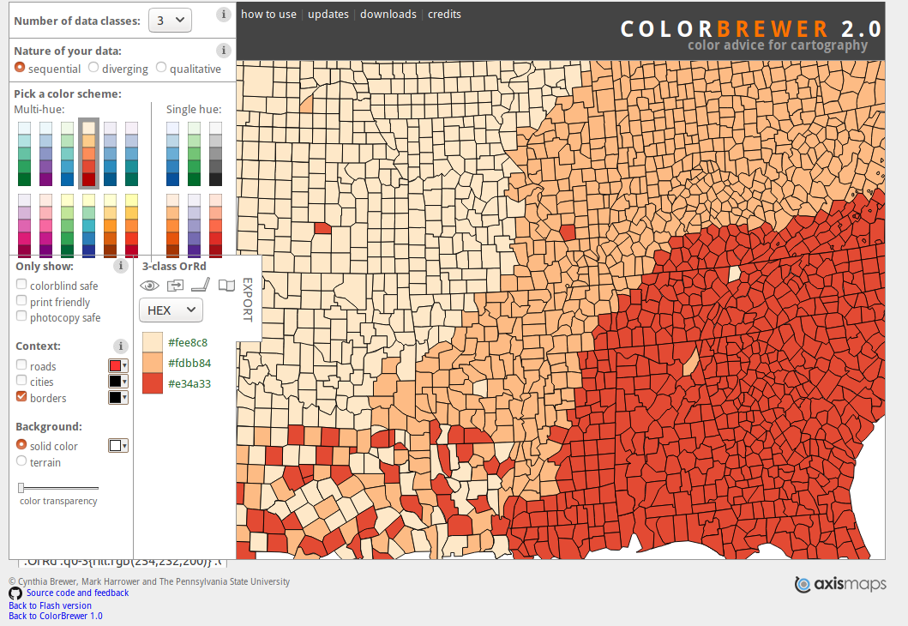
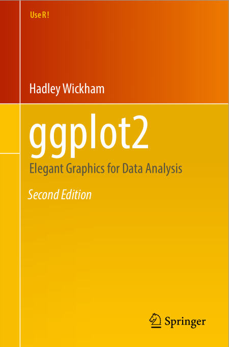

```{r setup, include=FALSE}
knitr::opts_chunk$set(echo=FALSE)
library(knitr)
```


Learning objectives
=====================================
- Functions
  - User defined functions 
  - using anonymous function in *apply()*
  
- Introduction to Bioconductor
  - Bioconductor in genomic research 
  - Common packages
  
- Data wrangling 
  - aggregate()
  - other functions()

- Plotting using ggplot
- From here to where?


User defined functions
===============================
- One of the great strengths of R is the user's ability to add functions. 
- many of the built-in functions in R are actually functions of functions. 

```{r eval=F, echo=T}
myfunction <- function(arg1, arg2, ... ){
  
  statement 1
  statement 2
  statements ...
  
  return(object)
}

```
- Objects in the function are local to the function
- can return only one object  
  - object returned can be any data type. 

Example: to calculate area of the circle
=========================
- Create a function that accepts radius of a circle and returns area of the circle. 

```{r  echo=T}

# area of a circle =  pi * r^2
area_circle <- function(r){
  area <- pi * r^2;
  return(area);
}

area_circle(1)
```
contd...

Example
=========================
```{r  echo=T}
## Using the function with a vector
x <- c(1,0.5,12)
area_circle(x)

## using with sapply()
sapply( x, area_circle )
```


Example: function for calculating area of a traingle
=========================
- Create a function that accepts height, width and base  of a triangle and returns area. 

```{r echo=T}
# area of a traingle =  height * base * width
area_triangle <- function(h ,b ,w){
  area <- h*b*w;
  return(area);
}

area_triangle(12,4,9)
```
contd..

Example: function for calculating area of a traingle
=========================
```{r echo=T}
## equal length vectors can be used as input 
h <- c(3,4,10,9)
b <- c(5,6,10,19)
w <- c(1,10,12,8)

area_triangle(h=h, b=b, w=w)
```


User defined functions: return()
=====================================
- the `return()` state ment returns the final processed value  
  - multiple values can be packages as   
  i. Named vector
  ii. Named List
  iii. Data frame
  
# Return different values: a named vector

```{r echo=T}
## return as a named vector
circle <- function(r){
  area <- pi * r^2; # pi x r^2
  circumference <- 2 * pi * r; # 2 x pi x r
  result <- c(area=area, circumference=circumference )
  return(result);
}
##Use the function to calculate for r=1
circle(r=1)
##Use the function to calculate for r= a vector 
circle(r=c(1,0.5))
```

# Return different values:as a named list

```{r echo=T}
## return as a named vector
circle <- function(r){
  area <- pi * r^2; # pi x r^2
  circumference <- 2 * pi * r; # 2 x pi x r
  result <- list(
    area=area, 
    circumference=circumference
    )
  return(result);
}
##Use the function to calculate for r=1
circle(r=1);

x <- c(1,0.5)
circle(x)
```

# Return different values: As a named data frame

```{r echo=T}
## return as a named vector
circle <- function(r){
  area <- pi * r^2; # pi x r^2
  circumference <- 2 * pi * r; # 2 x pi x r
  result <- data.frame(
    area=area, 
    circumference=circumference 
    )
  return(result);
}
# Use the function 
circle(r=1);
circle(c(1,0.5))
```

Anonymous functions 
============================
- anonymous functions are not saved with a name.
- we do not want to reuse the code
- Usually written inline and used with *apply* functions

```{r echo=T}
marks <- matrix(sample(1:100, 20,replace=T), nrow=4)
colnames(marks) <- c('Physics','Chemistry','Math','Geography','Literature')
rownames(marks) <- c('foo','bar','baz','qux')
marks <- as.data.frame(marks)
head(marks)
```

Anonymous functions 
============================
- using with `apply()`  to calulate percentage  
```{r echo=T}
marks$Percentage <- apply(marks, 1,
      function(x){
       return(100*sum(x)/500)  
       } 
      )
head(marks)
```

Anonymous functions using  `paste()`
============================
```{r echo=T}
genes <- c('AT04G1245','AT01G9987','AT01G9861', 
           'AT01G8761','ATCh12301')

## Add a Prefix 'Ath|' to all genes
pre_genes <- sapply(genes, function(x){  
   return(paste('Ath',x,sep='|') )
  } )


pre_genes
```

Anonymous functions using `strsplit()`
============================
```{r echo=T}
## Split Ath from the pre_genes elements 

sapply(pre_genes, function(x){  
   return(strsplit(x,split="|", fixed=TRUE)[[1]][2] )
  } )
```

Data Wrangling
=====================
- Manipulating raw data tables in to more structured format.
1. Subletting tables
2. Sorting tables
3. Merging two tables
4. Aggregating Data
5. Reshaping tables

Sorting tables
=======================
- To sort a vector/dataframe in R, use the *order()* function. 
  - returns the vector indexes
  - Default: sorting is ASCENDING. 
  - With minus sign (-) Pre-fixed to a variable indicates DESCENDING order.
```{r echo=T}
x <- c(10,8,6,8,14)
x
# Returns increasing indexes 
order(x)
x[order(x)]
# Returns decreasing  indexes 
x[order(x, decreasing=TRUE)]
```

Sorting tables
=======================
```{r echo=T}
df <- data.frame(
  A=c(10,2,18,50),
  B=c(4,2,12,10),
  C=c(1,3,9,5)
)
df
```
Sorting tables
=======================
```{r echo=T}
df[order(df$A, decreasing=TRUE), ]
```


Compute Summary Statistics of Data Subsets
========================
- *aggregate()* : computes summary statistics for each category
```{r echo=T}
women_data <- read.csv('Data/women.tsv', sep="\t")
# head(women_data, 10)

### Calculate mean Heights for each Age category

aggregate(
  x=women_data[, c('Height','Weight')] ,
  by=list(Women_age=women_data$Age
        ),
  mean)
```

Merging Data tables
=============================
- *merge ()*: merge two data frames (datasets) horizontally by one or more common key variables (i.e., an inner join). 

```{r echo=T}
## Gene table
exprs <- data.frame(Gene=c('FLC', 'FT', 'AG', 'LFY', 'CO', 'AP1'),
                    TPM= c(0.5,2.3,12,9.1,21.03,14)
                    )
head(exprs)
```

Merging Data tables
=============================
```{r echo=T}
## Gene descriptions 
desc <- data.frame(Gene=c('FLC', 'FT', 'AG', 'LFY', 
                          'CO', 'AP1','EIN2','ABI1', 'ABI3'),
                    AA_len= c(143,144,51,291,
                              101,50,33,90,105),
                    Description=c('Repressor of flowers', 
                      'Mobile floral stimulus protein', 
                      'Regulator of floral identity',
                       'Regulator of flowering', 
                       'Regulator of flowering',
                       'Regulator of floral organ identity', 
                       'Ethylene receptor',
                       'Abscisic acid signaling repressor', 
                       'Abscisic acid response regulator')
                    )
head(desc)
```
contd...


Merging Data tables
=============================
## Merged table
```{r echo=T}
head(merge(exprs,desc, by="Gene"))
```

Subsetting using ` %in%` operator
===============================
- `%in%` is a very handy operator to match two vectors.
  - x %in% y: compares each elements of `x` in its left vector `y`
  - returns a logical vector if a value from `x` is found in `y`
```{r echo=T}
x <- c('a','c','b','p','o','x')
y <- c('a','b','x','c','d','e')
x %in% y
# y %in% x  ## try 
## Subset a named dataframe 
exprs[exprs$Gene %in% c('AP1','FT','LFY'), ]
```


Data arrangements
================================
### Wide and Two-Dimensional: The Spreadsheet
```{r echo=T}
df <- data.frame(
  Genes=c('Gene1','Gene2','Gene3','Gene4','Gene5'),
  Sample1=sample(seq(0,10, by=1.083), size = 5, replace = T),
  Sample2=sample(seq(0,10, by=2.1), size = 5, replace = T),
  Sample3=sample(seq(0,10, by=3.2), size = 5, replace = T) 
)

df
```

Data arrangements
================================
### Long and Skinny: The Database
```{r echo=F}
library(reshape2)
df2 = melt(df)
names(df2) = c('Genes','Sample','Expression')
```
```{r echo=T}
head(df2)
```


Data arrangements
================================
- Wide format is more human readable and easy to interpret
- Long format is best for data analysis
  - suitable for ggplot2 plots 

`https://eagereyes.org/basics/`
`spreadsheet-thinking-vs-database-thinking`

Package: reshape2
=========================
- to convert Spreadsheet tables to long Database format and vice versa. 
  - melt() : wide =&gt; long 
  - cast() : long =&gt; wide

```{r eval=F, echo=T}

install.packages('reshape2')

```


Melting and Casting DFs
====================================
## melt()
```{r echo=T}
library(reshape2)
## use melt function 
melt(df, id="Genes")
```
```{r echo=T}
df2 <- melt(df, id="Genes")
names(df2) = c('Genes','Sample','Expression')
```

Melting and Casting DFs
====================================

## cast()
```{r echo=T}
## Genes ~ Sample: Describe Genes vs Sample
dcast(df2, formula=Genes ~ Sample)

```


Data visualization using 'ggplot2'
=================================
- *de facto* standard for data visualization.
- Design publication quality plots with less typing .
- Gives fine control over graphical elements using functions ('grammar') to build final image
- Create images as layers; easy to reuse previous codes.

The graphical grammar and its components 
==============================
Every graphical plot has following components  
- Data  
  The raw data table you want to plot  
- Layer  
  The plots (points, text, lines )  
- Scale   
  Maps data to the graphical output.   
- Coordinates  
  Visualization perspective (rotation, angle)  
- Faceting  
  Sub grouping the plots by categories.   
- Themes  
  Display details (Font, background color, font size)  

Working with ggplo2 grammar
============================
- **Data:** Raw data in Database format. 
  - required 
- **Aesthetics:** Mapping your data to the visualization
  - required 
- **Layers:** Creates the real visualization using the data and aesthetics provided.
  - at least one layer is required. 
  - usually have a pre-fix **geom_\<layer name\>**


Create a simple XY scatter plot
=====================
## Scatter plot using base R
```{r out.width="50%",dpi=96, fig.asp=0.62, fig.align="center", echo=T}
plot(
  x=iris$Sepal.Length, 
  y=iris$Sepal.Width,
  col='blue'
  )
```

Create a simple XY scatter plot
=====================
## Scatter plot using ggplot2 lib 
```{r out.width="50%", dpi=96, fig.asp=0.62, fig.align="center" , eval=F, echo=T}
# import library
library(ggplot2)

# Data and define aesthetics
p <- ggplot(data=iris, 
            aes(x=Sepal.Length, y=Sepal.Width )
            )

# add (+) scatterplot layer to visualize
p + geom_point(color='blue')

```
Create a simple XY scatter plot
=====================
```{r out.width="50%", dpi=96, fig.asp=0.62, fig.align="center" }
# import library
library(ggplot2)

# Data and define aesthetics
p <- ggplot(data=iris, 
            aes(x=Sepal.Length, y=Sepal.Width )
            )

# add (+) scatterplot layer to visualize
p + geom_point(color='blue')

```
Apply categorical Colors 
=====================
## Base R plot 

```{r echo=T}
# color to each species
levels(iris$Species)
```

```{r out.width="70%",dpi=96, fig.asp=0.62, fig.align="center", eval=F,echo=T}
color_point <- function(x){
  ifelse(x=="setosa",'red',
         ifelse(x=="versicolor",'blue','black')
  ) 
  }
plot(
  x=iris$Sepal.Length, 
  y=iris$Sepal.Width,
  col= sapply(iris$Species,color_point )
  )
```

Apply categorical Colors 
=====================
```{r out.width="70%",dpi=96, fig.asp=0.62, fig.align="center"}
color_point <- function(x){
  ifelse(x=="setosa",'red',
         ifelse(x=="versicolor",'blue','black')
  ) 
  }
plot(
  x=iris$Sepal.Length, 
  y=iris$Sepal.Width,
  col= sapply(iris$Species,color_point )
  )
```

Apply categorical Colors 
=====================
## Using ggplot2
```{r out.width="65%",dpi=96, fig.asp=0.62, fig.align="center", echo=T, eval=F}
# import library
library(ggplot2)

# Data and define aesthetics (x, y, color)
p <- ggplot(data=iris, 
            aes(x=Sepal.Length, y=Sepal.Width, color=Species)
            )

# add (+) scatterplot layer to visualize
p + geom_point()
```

Apply categorical Colors 
=====================
```{r out.width="65%",dpi=96, fig.asp=0.62, fig.align="center"}
# import library
library(ggplot2)

# Data and define aesthetics (x, y, color)
p <- ggplot(data=iris, 
            aes(x=Sepal.Length, y=Sepal.Width, color=Species)
            )

# add (+) scatterplot layer to visualize
p + geom_point()
```

Add user-defined colors
===============================
```{r echo=T}
# define colors for each category as a vector
species_color <- c('red','green','darkblue')
## Define category names to each color 
names(species_color) <- c("setosa","virginica","versicolor")
species_color
```
- use this vector to fill color  
```{r eval=F, echo=T}
# Use this mappings to scale_color_manual() layer
p + geom_point() + 
  scale_color_manual(values =species_color)
```

Add user-defined colors
===============================
```{r out.width="90%",fig.align='right', dpi=96, echo=F, fig.asp=0.62}

# Use this mappings to scale_color_manual() layer
p + geom_point() + 
  scale_color_manual(values =species_color)
```

Plot histogram geom_histogram()
================================

```{r eval=F, echo=T}
# import library
library(ggplot2)

# Data and define aesthetics
p <- ggplot(data=iris, 
            aes(x=Sepal.Width)
            )

# add (+) histogram layer to visualize
p + geom_histogram()
```

Plot histogram geom_histogram()
===============================
```{r out.width="65%",dpi=96, fig.asp=0.62, fig.align="center", echo=F}
# import library
library(ggplot2)

# Data and define aesthetics
p <- ggplot(data=iris, 
            aes(x=Sepal.Width)
            )

# add (+) histogram layer to visualize
p + geom_histogram()
```

Apply color by category
================================
```{r out.width="65%", dpi=96, echo=T}
# add (+) histogram layer define color category
p + geom_histogram(aes(fill=Species))
```


Apply color by category
================================
```{r out.width="95%", dpi=96, eval=F, echo=T}
# add (+) histogram layer define color category
p + geom_histogram(aes(color=Species),
                   fill="white",
                   alpha=0.5,
                   position="identity"
                   )
```

Apply color by category
================================
```{r out.width="95%", dpi=96, echo=F}
# add (+) histogram layer define color category
p + geom_histogram(
  aes(color=Species), 
  fill='white',
  alpha=0.5,
  position="identity"
  )
```

Apply color by category
=============================

```{r echo=F}
# define colors for each category as a vector
species_color <- c('red','green','darkblue')
## Define category names to each color 
names(species_color) <- c("setosa","virginica","versicolor")
species_color
```

```{r eval=F, echo=T}
# add (+) histogram layer + user defied color scale + theme
p + geom_histogram(
  aes(color=Species), 
  fill='white',
  alpha=0.5,
  position="identity"
  ) + 
  scale_color_manual(values =species_color) 
  
```

Apply color by category
=============================
```{r out.width="80%",dpi=96, fig.asp=0.62, fig.align="center", echo=F}
# add (+) histogram layer define color category
p + geom_histogram(
  aes(color=Species), 
  fill='white',
  alpha=0.5,
  position="identity"
  ) + scale_color_manual(values =species_color)
```


Multiple category bar plots 
==========================

```{r out.width="50%",dpi=96, fig.asp=0.62, fig.align="center", echo=T}
library(ggplot2)
# df2 from previous reshape lib slide 
p <- ggplot(data=df2, 
            aes(x=Sample, y=Expression, fill=Genes)
            )

# add (+) geom_bar
p + geom_bar(stat="identity")
```

Multiple category bar plots 
==========================
- with deafult options ggplot created a `stacked bar`.

```{r out.width="80%",dpi=96, fig.asp=0.62, fig.align="center", echo=T}
# Transform the position of the categories. 
p + geom_bar(stat="identity", position="dodge")
```

Heatmaps using geom_tile()
========================
- Use the values as **Fill** asthestics 

```{r out.width="50%",dpi=96, fig.asp=0.62, fig.align="center", echo=T}
library(ggplot2)

names(df2) = c('Genes','Sample','Expression')
# Data and define aesthetics
p <- ggplot(data=df2, 
            aes(x=Genes, y=Sample, fill=Expression)
            )
```

Heatmaps using geom_tile()
========================
```{r echo=F}
# add (+) tiles layer to visualize
p + geom_tile()
```

Heatmaps using geom_tile()
========================
- Use the values as **Fill** asthestics   
 - Use specific color range 

```{r out.width="50%",dpi=96, fig.asp=0.62, fig.align="center", echo=T}
## Add a color gradient scale 
p + geom_tile() + 
  scale_fill_gradient(low = "#fee8c8", high = "#e34a33")
```


Choosing Color Palettes  
==========================
## Online: ColorBrewer2.0 
URL: http://colorbrewer2.org/ 


Choosing Color Palettes  
==========================
## Online: ColorBrewer2.0 
Select color from three group  
  1. **Sequential:** Light colors for low data, dark for high data  
  2. **Diverging :**  Light colors for mid-range data, low and high contrasting dark colors  
  3. **Qualitative :** Co lours designed to give maximum visual difference between classes  

Choosing Color Palettes  
=======================
## R Packages
#### RColorBrewer 
- R packages that uses the scheme from ColorBrewer2.0  
```{r eval=F}
# Install package 
install.packages('RColorBrewer')
```

```{r echo=T}
# load package 
library(RColorBrewer)

# get the colors as a vector
brewer.pal(n = 3,name = 'YlOrRd')

brewer.pal(n = 5, name = 'Blues')
```

Choosing Color Palettes :RColorBrewer
=======================
### Example of Pallates
```{r eval=F, echo=T}
brewer.pal.info
```

```{r echo=F}
knitr::kable(brewer.pal.info[c('BrBG','RdBu','Accent','Set2','Greens','YlOrBr'),])
```

Choosing Color Palettes :RColorBrewer
=======================
### To view the color palette
```{r out.width="50px",dpi=96, fig.asp=0.62, fig.align="center", echo=T}
## display a divergent palette
display.brewer.pal(7,"BrBG")

## display a qualitative palette
display.brewer.pal(7,"Accent")

## display a  Sequential palette
display.brewer.pal(name="YlOrRd", n=8)

```

Choosing Color Palettes  
========================
## R Packages
#### ggsci
- color palettes inspired by plots in scientific journals, data visualization libraries, science fiction movies, and TV shows.
- URL: https://cran.r-project.org/web/packages/ggsci/vignettes/ggsci.html
```{r eval=F, echo=T}
# Install package 
install.packages('ggsci')
```
```{r echo=T}
## load library
library(ggsci)
# NPG: Nature Publishing Group 
pal_npg()(5)
# NEJM: he New England Journal of Medicine
pal_nejm()(3)
```

Choosing Color Palettes  
========================
### Default ggplot2 color scheme
```{r out.width="50%",dpi=96, fig.asp=0.62, fig.align="center", echo=T}
# import library
library(ggplot2)
# Data and define aesthetics
p <- ggplot(data=iris, 
            aes(x=Sepal.Width, fill=Species)
            )
# add (+) histogram layer to visualize
p + geom_histogram()
```

Choosing Color Palettes  
========================
#### ggsci: JCO color scheme
```{r out.width="90%",dpi=96, fig.asp=0.62, fig.align="center", echo=T}
# Journal of Clinical Oncology
p + geom_histogram()+
  scale_fill_jco()
```
***
#### ggsci: Lancet color scheme
```{r out.width="90%",dpi=96, fig.asp=0.62, fig.align="center", echo=T}
# Lancet Oncology
p + geom_histogram()+
  scale_fill_lancet()
```

Apply themes: ready made themes
===============================
### Default theme 
```{r out.width="65%",dpi=96, fig.asp=0.62, fig.align="center", echo=T}
# Data and define aesthetics (x, y, color)
p <- ggplot(data=iris, 
            aes(x=Sepal.Length, y=Sepal.Width, color=Species)
            )
p
```

Apply themes: ready made themes
===============================
### theme_classic()
  A classic-looking theme, with x and y axis lines and no gridlines.
```{r out.width="65%",dpi=96, fig.asp=0.62, fig.align="center", echo=T}
# add (+) scatterplot layer + black-white theme
p + geom_point() + theme_classic()

```

Apply themes: ready made themes
===============================
### theme_bw()
The classic dark-on-light ggplot2 theme.
```{r out.width="65%",dpi=96, fig.asp=0.62, fig.align="center", echo=T}
# add (+) scatterplot layer + black-white theme
p + geom_point() + theme_bw()

```

Apply themes: ready made themes
===============================
### theme_minimal():
A minimalistic theme with no background annotations. 
```{r out.width="65%",dpi=96, fig.asp=0.62, fig.align="center", echo=T}

# add (+) scatterplot layer + minimalistic theme
p + geom_point() + theme_minimal()
```

Modify axis, legend, and plot labels
====================================

```{r eval=F,echo=T}
p + geom_point()+
  labs(
    title="Title: Sepal.Length Vs Sepal.Width", 
       
       subtitle="Subtitle: iris dataset",
       
       tag="A",
       
       caption="Figure caption: Scatterplot comparing Sepal length and width in three species. "
       ) +
  ylab("Sepal width (in cm) ")+
  xlab("Sepal length (in cm) ")

```

Modify axis, legend, and plot labels
====================================
```{r out.width="90%", dpi=120, fig.align="center", echo=F}
p + geom_point()+
  labs(
    title="Title: Sepal.Length Vs Sepal.Width", 
       
       subtitle="Subtitle: iris dataset",
       
       tag="A",
       
       caption="Figure caption: Scatterplot comparing Sepal length and width in three species. "
       ) +
  ylab("Sepal width (in cm) ")+
  xlab("Sepal length (in cm) ")

```

Multiple plots
==========================
## Create figures and save in a variable
```{r out.width="50%",dpi=150, fig.asp=0.62, fig.align="center",echo=T}
library(ggplot2)

p1 <- ggplot(data=iris, aes(x=Sepal.Width,y=Sepal.Length, color=Species)) +
  geom_point()+theme(legend.position="top")+
  labs(tag='A')
p1
```

Multiple plots
==========================
## Create figures and save in a variable
```{r out.width="50%",dpi=150, fig.asp=0.62, fig.align="center",echo=T}
p2 <- ggplot(data=iris, aes(x=Sepal.Length,fill=Species)) +
  geom_histogram(color='white')+
  theme(legend.position="top")+
  labs(tag='B')

p2
```

Multiple plots
==========================
## Create joint figures
```{r out.width="70%",dpi=150, fig.asp=0.62, fig.align="center",echo=T}
library(gridExtra)
grid.arrange(p1,p2, nrow=1, respect=TRUE, clip=TRUE) 
```

Add tables with figures
==============================
```{r echo=T}
## Table as a data frame 
df <- data.frame(Genes=c('PHYB', 'PHYA', 'CRY1','COP1','HY5'),
                 Sample_a=seq(5,20, length=5),
                 Sample_b=sample(seq(1,20), 5 )
                 )
row.names(df) <- df$Genes
exprs <- melt(df)
names(exprs) <- c('Genes','Sample', 'FPKM')
```

Add tables with figures
==============================
```{r out.width="50%",dpi=120, fig.asp=0.62, fig.align="center", echo=T}
## Graphical object 
p1 <- ggplot(data=exprs, aes(x=Genes, y=FPKM, fill=Sample))+
  geom_bar(stat="identity", position="dodge", color='white')+
  theme(legend.position="top")
p1
```

Add tables with figures
==============================
```{r out.width="70%",dpi=120, fig.asp=0.62, fig.align="center", echo=T}
grid.arrange(tableGrob(head(df[,2:3])), p1, 
             nrow=1, 
             respect=TRUE )
```

Save plot to file
=============================
```{r eval=F, echo=T}
## Save the 'current ggplot' to file 
ggsave("ggPlot_figure.pdf", width = 4, height = 4)

## If p1 or p2 are graphical objects
ggsave("ggPlot_figure.p1.pdf", width = 4, height = 4, 
       plot=p1)
ggsave("ggPlot_figure.p2.pdf", width = 4, height = 8,
       plot=p2)
```


More on ggplot2
=======================
ggplot2: Elegant Graphics for Data Analysis  
 Hadley Wickham  
Free e-book: https://ggplot2-book.org/  



Bio-conductor: Bioinformatics repository
==========================
- Bioconductor (www.bioconductor.org)is a project within R.  
- Bioconductor works with a high throughput genomic data from DNA sequence, micro-array, proteomics, imaging and a number of other data types.
- The current available version of Bioconductor (Version 3.6) consists of 1477 software packages.

## Why 
- dependencies: It makes very easy to resolve library dependencies. 
- compatibility : Correct and compatible versions of all the dependencies are installed.
- Reliability : Packages in Bioconductor are (reasonably) reliable. Compiled every day by someone around the world. So any error will be reported. 

Bio-conductor: Bioinformatics repository
==========================
## Install core packages 
```{r eval=F, echo=T}
install.packages("BiocManager")
```

## Install a package from Bioconductor
```{r eval=F, echo=T}
BiocManager::install('ape')
```

## Update all packages
```{r eval=F, echo=T}
BiocManager::install()
```


Where to go from here?
===============================

- Take your data, import in R 
- Search Internet
  - How to do ... use keyword **R**
  - Stack overflow, R-blogger
- Follow YouTube channels, blog sites
  - twitter hash tags:
  - #rstats
  - one R tip per day (@RLangTip)

- Print a cheatsheet  
- Each day practice a little.


Thank you for participating
=================

- Email - kcm.eid@gmail.com  
- Twitter - @kc_moharana  

```{r out.width='100px', echo=F}
knitr::include_graphics('Figures/nebbio_logo.png')
```
